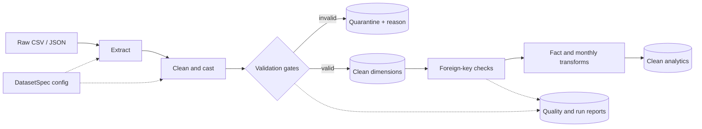

# Configuration-Driven Python ETL Pipeline: Version 2

A fault-tolerant, multi-source batch pipeline that turns local commerce CSV and
JSON files into validated dimensions, an order-item fact table, monthly
analytics, quarantined records, and run-level quality reports.

This repository is the second iteration of my first data engineering project.
The main goal was not simply to add more transformations, but to redesign the
notebook prototype into a project that is easier to run, test, observe, and
extend.

## What changed from version 1

| Design area | Version 1 | Version 2 |
|---|---|---|
| Data model | Three independent sources | Seven normalized commerce sources plus fact and summary outputs |
| Configuration | Nested transformation dictionaries | Typed, immutable `DatasetSpec` dataclasses |
| Invalid records | A quality error stops the pipeline | Invalid rows are quarantined; valid rows continue |
| Failure isolation | One failure stops the batch | Each dataset is isolated and the remaining sources continue |
| Data quality | Schema, null, uniqueness, and non-negative checks | Adds allowed values, ranges, rejection reasons, and foreign-key checks |
| Observability | In-memory run result and logs | Metrics CSV, quality CSV/JSON, and a JSON run summary |
| Analytics | Clean source-shaped tables | Enriched `fact_order_items` and monthly commerce summary |
| Development flow | Script and unit tests | Modular package, CLI, focused unit/integration tests, and retained notebook lineage |

The central simplification is `DatasetSpec`: one contract declares a dataset's
file, business key, required fields, data types, normalization rules, and
quality constraints. This removes long, repeated transformer lists while
keeping the behavior visible to a beginner reading the project.

## Architecture



See [docs/architecture.md](docs/architecture.md) for component responsibilities
and failure behavior.

## Repository structure

```text
.
|-- config/
|   `-- datasets.py            # Typed source and quality contracts
|-- data/                      # Local raw inputs (large files ignored by Git)
|   |-- clean/                 # Generated dimensions, facts, and summaries
|   |-- quarantine/            # Rejected rows with rejection reasons
|   `-- reports/               # Metrics, quality results, and run summary
|-- docs/
|   `-- architecture.md
|-- notebooks/
|   |-- pipeline_v2.ipynb          # Original version-2 prototype and learning record
|-- pipeline/
|   |-- enrichments.py
|   |-- extractors.py
|   |-- loaders.py
|   |-- orchestrator.py
|   |-- transformers.py
|   `-- validators.py
|-- tests/
|-- main.py                    # CLI entry point
|-- pipeline_v2.ipynb          # Original version-2 prototype and learning record
|-- PR_DESCRIPTION.txt
`-- requirements.txt
```

## Quick start

Requires Python 3.10 or newer.

```bash
python -m venv .venv

# Windows PowerShell
.venv\Scripts\Activate.ps1

# macOS/Linux
source .venv/bin/activate

python -m pip install -r requirements.txt
python main.py
```

Use different storage locations without editing code:

```bash
python main.py --input-dir path/to/raw --output-dir path/to/data_lake
```

## Outputs

Successful runs create clean source tables plus:

- `data/clean/fact_order_items.csv`: analytics-ready line-item grain with revenue, cost, profit, customer, payment, shipping, and location attributes.
- `data/clean/monthly_commerce_summary.csv`: monthly category performance.
- `data/quarantine/*_rejected.csv`: bad records retained with an exact rejection reason.
- `data/reports/pipeline_metrics.csv`: source, clean, rejected, duplicate, status, and timing metrics.
- `data/reports/data_quality_report.json`: machine-readable result for every quality gate.
- `data/reports/run_summary.json`: compact batch-level totals.

The large source datasets are deliberately ignored by Git. This avoids
publishing potentially sensitive or oversized data; tests generate small,
synthetic fixtures at runtime.

## Quality strategy

The pipeline separates two kinds of failure:

1. **Record defects** are recoverable. Null required values after casting,
   negative measures, out-of-range values, and duplicate keys go to quarantine.
2. **Dataset defects** are structural. Missing files, missing columns, or a
   completely empty clean result mark that dataset failed while other datasets
   continue.

Foreign-key failures are reported as warnings because they reveal upstream
master-data problems without hiding otherwise useful clean records.
Unexpected categorical values are warnings for the same reason: they may signal
business vocabulary drift and need review, but do not automatically prove that
the record is unusable.

## Tests

```bash
python -m unittest discover -s tests -v
```

The tests cover column normalization, numeric coercion, quarantine reasons,
duplicate handling, clean loading, report creation, and fault-tolerant analytics
skipping.

## Add a dataset

Add one `DatasetSpec` to `config/datasets.py`, place the matching file in the
input directory, and run `python main.py`. A new source format needs a new
extractor adapter; an existing CSV or JSON source needs configuration only.

## Portfolio learning

Version 1 established separation of ETL responsibilities. Version 2 builds on
that foundation with contracts, normalized inputs, dependency-aware analytics,
fault tolerance, quarantine storage, and operational evidence. The notebook is
kept intentionally as provenance, while `main.py` and the package are the
production-style execution path.
