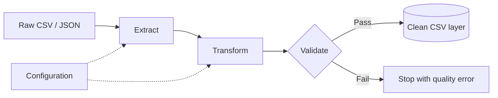

# Configuration-Driven Python ETL Pipeline

A compact, production-style batch pipeline that extracts e-commerce data from
CSV and JSON files, applies reusable transformations, enforces data-quality
rules, and writes validated datasets to a clean data-lake layer.

I built this project while moving from notebook-based exploration toward the
way data pipelines are organized in production: small modules, explicit
contracts, automated checks, observable runs, and a command-line entry point.

## Why this project stands out

- **Configuration driven:** sources, transformations, quality rules, and targets
  live in one dictionary registry. Existing adapters can be reused without
  writing a separate script for every dataset.
- **Extensible components:** extractors and transformations share small
  interfaces, making new formats and cleaning rules straightforward to add.
- **Quality before loading:** required fields, nulls, duplicates, and negative
  business metrics are checked before data reaches the clean layer.
- **Runs immediately:** the repository contains synthetic, anonymized sample
  data, so no credentials or external services are required.
- **Tested:** unit tests cover transformations and quality rules, plus an
  integration test executes a complete pipeline.

## Architecture



See [docs/architecture.md](docs/architecture.md) for the component map and
responsibilities.

## Quick start

Requires Python 3.10 or newer.

```bash
python -m venv .venv
# Windows
.venv\Scripts\activate
# macOS/Linux
source .venv/bin/activate

python -m pip install -r requirements.txt
python main.py
```

The command runs all configured pipelines and creates:

```text
data/clean/customers.csv
data/clean/products.csv
data/clean/orders.csv
```

Run just one dataset or override the storage locations:

```bash
python main.py --pipeline orders
python main.py --input-dir path/to/raw --output-dir path/to/clean
```

## Repository structure

```text
.
|-- data/
|   |-- raw/                  # Small synthetic inputs tracked by Git
|   `-- clean/                # Generated outputs ignored by Git
|-- docs/architecture.md
|-- notebooks/                # Original exploration notebook
|-- pipeline/
|   |-- config.py             # Dataset registry
|   |-- extractors.py
|   |-- loaders.py
|   |-- orchestrator.py
|   |-- transformers.py
|   `-- validators.py
|-- tests/
|-- main.py
`-- requirements.txt
```

## Add another data source

For a new CSV or JSON source that uses existing cleaning steps, add one entry to
`PIPELINE_CONFIGS` in `pipeline/config.py`:

```python
"inventory": {
    "source": {"type": "csv", "file": "inventory.csv"},
    "transformations": [
        {"name": "standardize_columns"},
        {"name": "cast_types", "options": {"columns": {"quantity": "int"}}},
        {"name": "drop_duplicates", "options": {"subset": ["sku"]}},
    ],
    "validation": {
        "required_columns": ["sku", "quantity"],
        "unique_columns": ["sku"],
        "non_negative_columns": ["quantity"],
    },
    "target": {"file": "inventory.csv"},
}
```

Place `inventory.csv` in `data/raw/`, then run
`python main.py --pipeline inventory`. A genuinely new format only requires a
new extractor adapter and one factory registration.

## Data privacy

All files in `data/raw/` are fabricated for demonstration. Names, identifiers,
emails, transactions, and amounts do not represent real people or activity.
The larger datasets used during development remain local and are excluded by
`.gitignore`.

## Tests

```bash
python -m unittest discover -s tests -v
```

## Possible next steps

- Add Parquet and database targets.
- Persist run metrics for operational monitoring.
- Add referential-integrity checks between orders, customers, and products.
- Schedule the command with Airflow or another workflow orchestrator.
