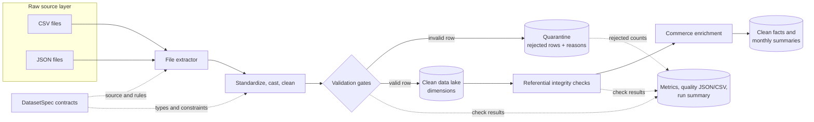

# Version 2 architecture

Version 2 uses a small data-lake layout. Source files are treated as immutable
raw inputs. Valid records flow to the clean layer, while invalid records are
preserved with a reason in quarantine. Reports make every run auditable.

## Layer responsibilities

| Concern | Module | Responsibility |
|---|---|---|
| Configuration | `config/datasets.py` | Defines source files, keys, types, and quality rules with `DatasetSpec` |
| Extraction | `pipeline/extractors.py` | Reads record-oriented JSON and CSV sources |
| Transformation | `pipeline/transformers.py` | Standardizes columns, cleans values, casts types, and separates rejected rows |
| Validation | `pipeline/validators.py` | Prevents empty or key-invalid datasets from entering clean storage |
| Loading | `pipeline/loaders.py` | Writes deterministic CSV outputs and JSON reports |
| Enrichment | `pipeline/enrichments.py` | Checks foreign keys and creates the order-item fact and monthly summary |
| Orchestration | `pipeline/orchestrator.py` | Isolates failures, captures metrics, and coordinates all stages |
| Entry point | `main.py` | Provides one command for a complete local run |

## Failure behavior

Row-level defects such as invalid required values, negative measures, and
duplicate keys do not stop the batch. Those records are
written to `data/quarantine/<dataset>_rejected.csv` with a
`rejection_reason`. A missing file, missing required column, or empty clean
dataset fails only the affected source; other independent sources continue.
Analytics outputs are skipped when a required clean dependency is unavailable.
Unexpected categories and foreign keys are reported as warnings because they
can indicate upstream vocabulary or master-data drift without making the full
record unusable.
