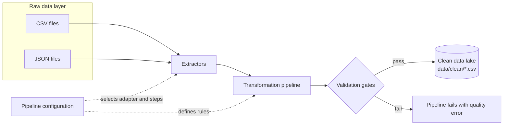

# Pipeline architecture

The repository follows a small medallion-style flow: immutable demo inputs are
treated as the raw layer, and only records that pass quality checks enter the
clean layer.

## Responsibilities

| Layer | Module | Responsibility |
|---|---|---|
| Extract | `pipeline/extractors.py` | Convert CSV or JSON sources into DataFrames |
| Transform | `pipeline/transformers.py` | Apply ordered, reusable cleaning steps |
| Validate | `pipeline/validators.py` | Enforce schema, null, uniqueness, and range rules |
| Load | `pipeline/loaders.py` | Persist validated records to the clean layer |
| Orchestrate | `pipeline/orchestrator.py` | Run stages and return execution metrics |
| Configure | `pipeline/config.py` | Declare each source without creating another script |
